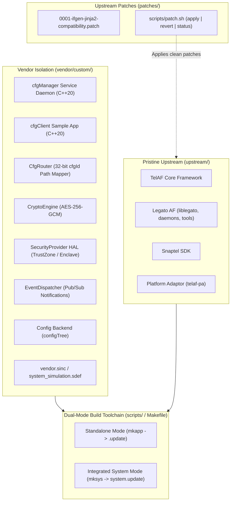

# Qualcomm TelAF & Vendor Monorepo (C++20) - Simulation Environment

[](#)
[](#)
[-brightgreen.svg)](#)
[](#)
[](#)

A modern **C++20** automotive-grade monorepo containing pristine **Qualcomm Telematics Application Framework (TelAF)** simulation sources in `upstream/`, managed patch sets in `patches/`, and custom configuration management service (`CfgManager`) in `vendor/custom/`.

---

## Architecture Overview



---

## Key Features

- **Automotive Monorepo Structure:** 
  - `upstream/`: 100% pristine Qualcomm TelAF simulation source tree (no in-tree modifications).
  - `patches/`: Version-controlled patch sets applied and reverted via `scripts/patch.sh`.
  - `vendor/custom/`: Isolated custom code containing all components, apps, samples, interfaces, and unit tests.
- **Dual Build Support:**
  - **Standalone Mode (`--standalone`):** Compiles `cfgManager` and `cfgClient` using `mkapp -t simulation` into `.update` packages for fast, iterative deployment.
  - **Integrated Mode (`--integrated`):** Integrates `vendor/custom/vendor.sinc` via `system_simulation.sdef`, baking `cfgManager` directly into the full TelAF simulation system image.
- **Path Abstraction via Composite `cfgId`:** Consumer applications interact purely with 32-bit composite IDs (`[Subsystem 8b][Category 8b][Flags 8b][KeyId 8b]`). Internal filesystem paths and `configTree` trees remain completely hidden from consumers.
- **Three-Tier Data Classification:**
  - **RawData:** Direct storage in TelAF `configTree`.
  - **SensitiveData:** Authenticated encryption using OpenSSL **AES-256-GCM** with unique 96-bit random IV and 128-bit authentication tag per entry.
  - **SecureData:** Hardware root-of-trust storage via TrustZone / OP-TEE HAL with automatic simulated enclave fallback.
- **Pub/Sub Change Notifications:** Real-time event propagation via Legato event loop with ID-specific and subsystem-wide filters.
- **C++20 Standard:** Strictly limited to `-std=c++20` across all components, samples, tests, and build definitions.
- **Google Test Suite:** 45 automated unit tests with C2 branch coverage.

---

## Directory Layout

```text
legato_rpi/  (Branch: feat/telaf-simulation)
├── upstream/                         # Pristine Qualcomm TelAF Simulation Sources
│   ├── telaf/                        # TelAF Core Framework
│   ├── legato/                       # Legato Application Framework (legato-af)
│   ├── sdk/                          # Snaptel SDK
│   ├── telaf-pa/                     # Platform Adaptor
│   └── telaf-pa-default/             # Platform Adaptor Default
│
├── patches/                          # Upstream Patches (Version-controlled)
│   └── legato/
│       └── 0001-ifgen-jinja2-compatibility.patch
│
├── vendor/                           # Custom Development Code (C++20)
│   └── custom/                       # Custom vendor namespace
│       ├── apps/
│       │   └── cfgManager/           # CfgManager service daemon
│       ├── components/
│       │   └── cfgManager/           # 5 core subsystems (core, crypto, security, storage, events)
│       ├── samples/
│       │   └── cfgClient/            # Client demo app
│       ├── interfaces/
│       │   └── cfgManager.api        # RPC IDL definition
│       ├── tests/                    # Google Test C++20 suites
│       ├── vendor.sinc               # System include for TelAF integration
│       └── system_simulation.sdef    # Integrated system definition
│
├── scripts/                          # Build & Deployment Tooling
│   ├── patch.sh                      # Apply, revert, inspect upstream patches
│   ├── build.sh                      # Dual-mode builder (--standalone | --integrated)
│   ├── deploy.sh                     # Runtime package deployer & live verifier
│   ├── run-simulation.sh             # Container lifecycle manager (start|stop|status|shell)
│   └── run-unit-tests.sh             # Google Test C++20 test runner
│
├── Makefile                          # Unified developer CLI interface
├── docs/                             # Architecture & Integration Guides
└── README.md                         # Project documentation
```

---

## Developer Quickstart

The repository provides a top-level `Makefile` for developer convenience:

### 1. Run Unit Tests (Google Test C++20)
```bash
make test
```
Or with branch coverage report:
```bash
make coverage
```
All 45 tests across 9 test suites will run and report 100% PASS.

### 2. Upstream Patch Management
To inspect, apply, or revert patches against `upstream/`:
```bash
make patch-status     # View status of upstream patches
make patch-apply      # Apply all patches to upstream/
make patch-revert     # Revert all patches (restore pristine upstream)
```

### 3. Build Applications (Dual Mode)

- **Standalone Mode (Default):**
  ```bash
  make build-app
  # Or: ./scripts/build.sh --standalone
  ```
  Generates `.update` packages:
  - `vendor/custom/apps/cfgManager/cfgManager.simulation.update`
  - `vendor/custom/samples/cfgClient/cfgClient.simulation.update`

- **Integrated System Mode:**
  ```bash
  make build-system
  # Or: ./scripts/build.sh --integrated
  ```
  Generates full TelAF simulation system image:
  - `vendor/custom/_build_system/system_simulation.simulation.update`

### 4. Deploy and Verify Live IPC on Simulation Container
```bash
make deploy
# Or: ./scripts/deploy.sh
```

Live output from syslog confirms all features:
```text
simulation user.info TelAF:  INFO | cfgClient | Target cfgIds: Raw=0x01020001, Sensitive=0x02030002, Secure=0x04030003, Bin=0x02040004
simulation user.info TelAF:  INFO | cfgClient | [RawData Result] Successfully read: 'rpi5-edge-gateway.local'
simulation user.info TelAF:  INFO | cfgClient | [SensitiveData Result] Decrypted transparently: 'M4st3r_P@ssw0rd_K3y#2026!'
simulation user.info TelAF:  INFO | cfgClient | [SecureData Result] Retrieved from TrustZone: 'HW-ROOT-OF-TRUST-TOKEN-994821'
simulation user.info TelAF:  INFO | cfgClient | [Binary Result] Retrieved 9 bytes: [ 0x10 0x20 0x30 0x40 0x50 0xDE 0xAD 0xBE 0xEF ]
simulation user.info TelAF:  INFO | cfgClient |  CfgManager Sample Client Demo Complete - ALL CHECKS PASSED!
simulation user.info TelAF:  INFO | cfgClient | >>> [CLIENT EVENT] Configuration changed: cfgId=0x01020001, Value='rpi5-edge-gateway.local'
simulation user.info TelAF:  INFO | cfgClient | >>> [CLIENT EVENT] Configuration changed: cfgId=0x01020001, Value='rpi5-edge-gateway-RECONFIGURED.local'
```

---

## Simulation Container Commands

```bash
make run-sim         # Start simulation runtime container
make sim-status      # Check container and TelAF daemons status
make sim-shell       # Attach interactive bash terminal
make stop-sim        # Stop simulation container
```
