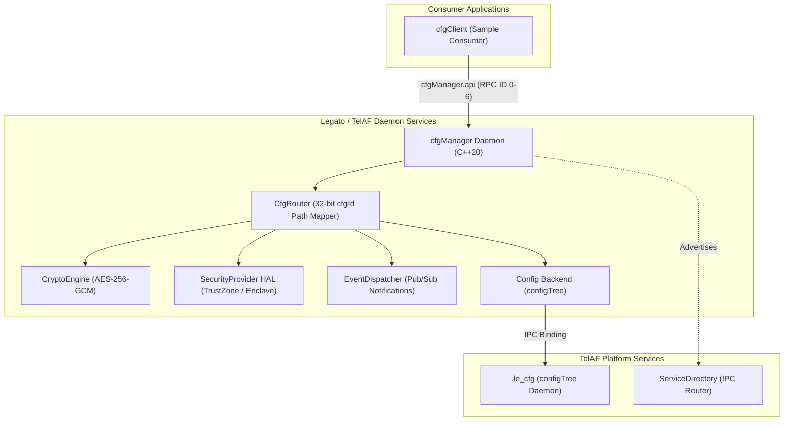

# Qualcomm TelAF CfgManager Service (C++20) - Simulation Environment

[](#)
[](#)
[-brightgreen.svg)](#)
[](#)

A modern **C++20** Configuration Management Service (`CfgManager`) running on the **Qualcomm Telematics Application Framework (TelAF) Simulation** environment.

---

## Architecture Overview



---

## Features

- **Path Abstraction via Composite `cfgId`:** Consumer applications interact purely with 32-bit composite IDs (`[Subsystem 8b][Category 8b][Flags 8b][KeyId 8b]`). Internal filesystem paths and `configTree` trees remain completely hidden from consumers.
- **Three-Tier Data Classification:**
  - **RawData:** Direct storage in TelAF `configTree`.
  - **SensitiveData:** Authenticated encryption using OpenSSL **AES-256-GCM** with unique 96-bit random IV and 128-bit authentication tag per entry.
  - **SecureData:** Hardware root-of-trust storage via TrustZone / OP-TEE HAL with automatic simulated enclave fallback.
- **Pub/Sub Change Notifications:** Real-time event propagation via Legato event loop with ID-specific and subsystem-wide filters.
- **C++20 Standard:** Implemented using modern C++20 features, concepts, structured bindings, and RAII.
- **Google Test Coverage:** 45 automated unit tests with C2 branch coverage.

---

## Repository Layout

```text
legato_rpi/  (Branch: feat/telaf-simulation)
├── components/                       # Reusable business logic C++20 components
│   └── cfgManager/
│       ├── core/                     # cfgId, cfgRouter, cfgManagerService
│       ├── crypto/                   # AES-256-GCM crypto engine
│       ├── security/                 # TrustZone / OP-TEE / Simulated Enclave HAL
│       ├── storage/                  # configTree & memory backend
│       └── events/                   # Event dispatcher
│
├── apps/                             # Legato/TelAF Application Packages
│   └── cfgManager/                   # CfgManager daemon service (.adef, Component.cdef)
│
├── samples/                          # Sample Applications
│   └── cfgClient/                    # CfgManager demo client (.adef, clientComponent)
│
├── interfaces/                       # Legato IPC API Definitions
│   └── cfgManager.api                # TelAF RPC function/event numbering
│
├── scripts/                          # Automated Developer Tooling
│   ├── build.sh                      # Builds cfgManager & cfgClient for simulation
│   ├── deploy.sh                     # Deploys & runs live demo on runtime container
│   ├── run-simulation.sh             # Manages container lifecycle (start|stop|status|shell)
│   └── run-unit-tests.sh             # Google Test runner with C2 coverage
│
├── tests/                            # Google Test C++20 Unit Tests
│   ├── core/
│   ├── crypto/
│   ├── security/
│   ├── storage/
│   ├── events/
│   ├── service/
│   └── CMakeLists.txt
│
└── docs/                             # Guides & Architecture Specifications
    ├── telaf_simulation.md           # TelAF simulation setup & execution guide
    └── CFG_MANAGER.md                # CfgManager service specification
```

---

## Quickstart

### 1. Start TelAF Simulation
Launch the Qualcomm TelAF simulation container:
```bash
./scripts/run-simulation.sh start
```

Verify framework status:
```bash
./scripts/run-simulation.sh status
```

### 2. Run Google Test Unit Tests
Execute the pure C++20 unit test suite with coverage:
```bash
./scripts/run-unit-tests.sh --coverage
```
All 45 tests across 9 test suites will run and report 100% PASS.

### 3. Build TelAF Packages
Compile both `cfgManager` and `cfgClient` for target `simulation` using the development container:
```bash
./scripts/build.sh
```
Build outputs:
- `apps/cfgManager/cfgManager.simulation.update`
- `samples/cfgClient/cfgClient.simulation.update`

### 4. Deploy and Verify Live IPC Execution
Deploy both applications into the running simulation container and verify end-to-end communication:
```bash
./scripts/deploy.sh
```

Live output from syslog confirms all features:
```text
simulation user.info TelAF:  INFO | cfgClient | Target cfgIds: Raw=0x01020001, Sensitive=0x02030002, Secure=0x04030003, Bin=0x02040004
simulation user.info TelAF:  INFO | cfgClient | [RawData Result] Successfully read: 'rpi5-edge-gateway.local'
simulation user.info TelAF:  INFO | cfgClient | [SensitiveData Result] Decrypted transparently: 'M4st3r_P@ssw0rd_K3y#2026!'
simulation user.info TelAF:  INFO | cfgClient | [SecureData Result] Retrieved from TrustZone: 'HW-ROOT-OF-TRUST-TOKEN-994821'
simulation user.info TelAF:  INFO | cfgClient | [Binary Result] Retrieved 9 bytes: [ 0x10 0x20 0x30 0x40 0x50 0xDE 0xAD 0xBE 0xEF ]
simulation user.info TelAF:  INFO | cfgClient |  CfgManager Sample Client Demo Complete - ALL CHECKS PASSED!
simulation user.info TelAF:  INFO | cfgClient | >>> [CLIENT EVENT] Configuration changed: cfgId=0x01020001, Value='rpi5-edge-gateway.local'
simulation user.info TelAF:  INFO | cfgClient | >>> [CLIENT EVENT] Configuration changed: cfgId=0x01020001, Value='rpi5-edge-gateway-RECONFIGURED.local'
```

---

## Simulation Container Commands

```bash
./scripts/run-simulation.sh start    # Start simulation container
./scripts/run-simulation.sh status   # Check container and TelAF daemons status
./scripts/run-simulation.sh shell    # Attach interactive bash terminal
./scripts/run-simulation.sh logs     # Stream live syslog
./scripts/run-simulation.sh stop     # Stop simulation container
```
